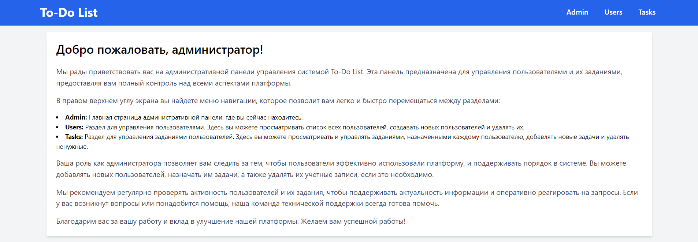
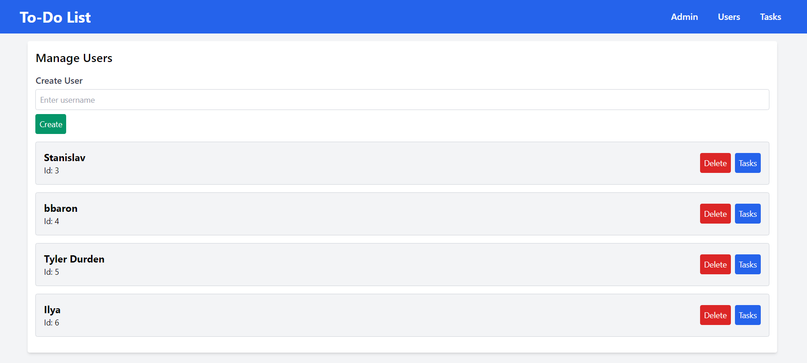
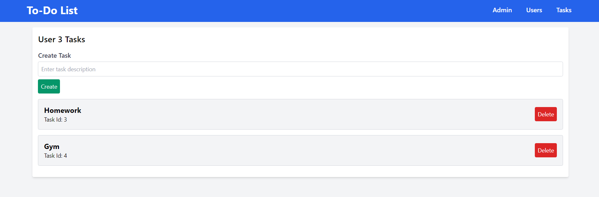

# Приложение "To Do List"

## Обзор

Добро пожаловать в административное приложение "To Do List", созданное для управления пользователями и их задачами. Это веб-приложение разработано с использованием FastAPI, PostgreSQL и Alembic. С его помощью администраторы могут просматривать, добавлять и удалять пользователей, а также управлять их задачами.

## Функциональные возможности

- **Управление пользователями**: просмотр списка всех пользователей, создание новых пользователей и удаление существующих.
- **Управление задачами пользователей**: просмотр задач конкретного пользователя, создание новых задач и удаление существующих задач.

## Установка и запуск

### 1. Создание .env файла

Перед запуском приложения необходимо создать файл `.env` в корневой директории проекта. Вы можете скопировать и переименовать файл `.env_example` в `.env`, а затем заменить значения переменных на свои. Пример файла `.env`:

```plaintext
# Конфигурация базы данных PostgreSQL
POSTGRES_DB=db_name
POSTGRES_USER=user
POSTGRES_PASSWORD=password
POSTGRES_OUT_PORT=5438
POSTGRES_IN_PORT=5432

# Конфигурация pgAdmin
PGADMIN_DEFAULT_EMAIL=your_email@mail.ru
PGADMIN_DEFAULT_PASSWORD=password
PGADMIN_PORT=5050

# Конфигурация FastAPI
APP_CONFIG__DB__URL=postgresql+asyncpg://${POSTGRES_USER}:${POSTGRES_PASSWORD}@pg_db:${POSTGRES_IN_PORT}/${POSTGRES_DB}
FASTAPI_PORT=8008
```

### 2. Запуск с использованием Docker

Для запуска приложения используйте Docker и Docker Compose. Выполните следующие команды в терминале:

```bash
docker-compose build
docker-compose up
```

Это запустит все необходимые сервисы, включая PostgreSQL, pgAdmin и FastAPI.

## Приложение в действии

В этом разделе представлены скриншоты различных страниц приложения для демонстрации его функциональности и интерфейса.

### Главная страница администратора


### Страница управления пользователями


### Страница задач пользователя


## Технологии

- **FastAPI** - современный, быстрый (высокопроизводительный) веб-фреймворк для создания API.
- **PostgreSQL** - мощная, объектно-реляционная система управления базами данных.
- **Alembic** - инструмент для управления миграциями базы данных.
